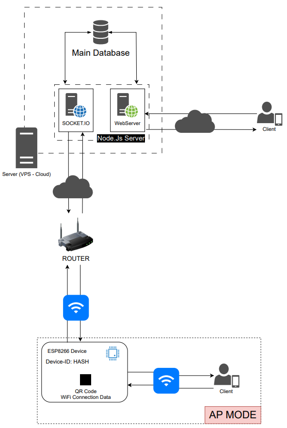

# PPC System

PPC System es un sistema de gestión para ESP8266 que permite administrar entradas y salidas a través de un software diseñado para facilitar la lectura y configuración de los parámetros deseados por el usuario.

## Características

- **Sistema de eventos:** Permite la programación de eventos en el tiempo, pudiendo crear intervalos personalizados o eventos fijos.
- **Modos de operación:** Comunicación con el módulo ESP8266 vía WiFi en modo AP o STA conectado a una red WiFi externa. Ambos modos permiten utilizar el software al 100%, incluso sin tener WiFi en el lugar de uso.
- **Intercambio de datos:** A través de una API diseñada para gestionar el dispositivo.
- **Interfaz de usuario (UI):** Enfocada en una buena experiencia de desarrollo utilizando TailwindCSS para generar interfaces modernas y ligeras.
- **WebSockets:** Permite intercambiar datos con un servidor central para la gestión del dispositivo vía internet.

## Esquema de Conexiones

<p align="center">
  
</p>

## Requisitos

- **PlatformIO:** Esta aplicación está construida utilizando [PlatformIO](https://marketplace.visualstudio.com/items?itemName=platformio.platformio-ide) sobre VSCode.
- **Arduino Framework:** PPC System está desarrollado utilizando el [framework de Arduino para ESP8266](https://github.com/esp8266/Arduino).
- **Node y npm:** Necesarios para compilar y minificar el código del módulo UI.

## Entorno de desarrollo

### Configuración de PlatformIO

1. Abre el proyecto en VSCode con PlatformIO instalado.
2. Instala las dependencias del proyecto ejecutando:
    ```bash
    pio pkg install
    ```

### Configuración del Módulo UI

1. Navega al directorio `/web`:
    ```bash
    cd web
    ```
2. Instala los paquetes necesarios:
    ```bash
    npm install
    ```
3. Compila y minifica el código:
    ```bash
    npm run build
    ```
4. Los archivos generados (`index.html`, `script.js`, `style.css`) se copiarán automáticamente a la carpeta `/data` para ser subidos a la memoria FLASH del dispositivo.

### Subida del Sistema de Archivos

1. Utiliza las herramientas de PlatformIO para subir la imagen del sistema de archivos:
    ```bash
    pio run --target uploadfs
    ```

## Uso

- El sistema permite una gestión completa del ESP8266 vía WiFi, utilizando la API y la UI desarrollada.
- La interfaz de usuario permite configurar y monitorear los eventos y parámetros del dispositivo de manera sencilla y eficiente.
